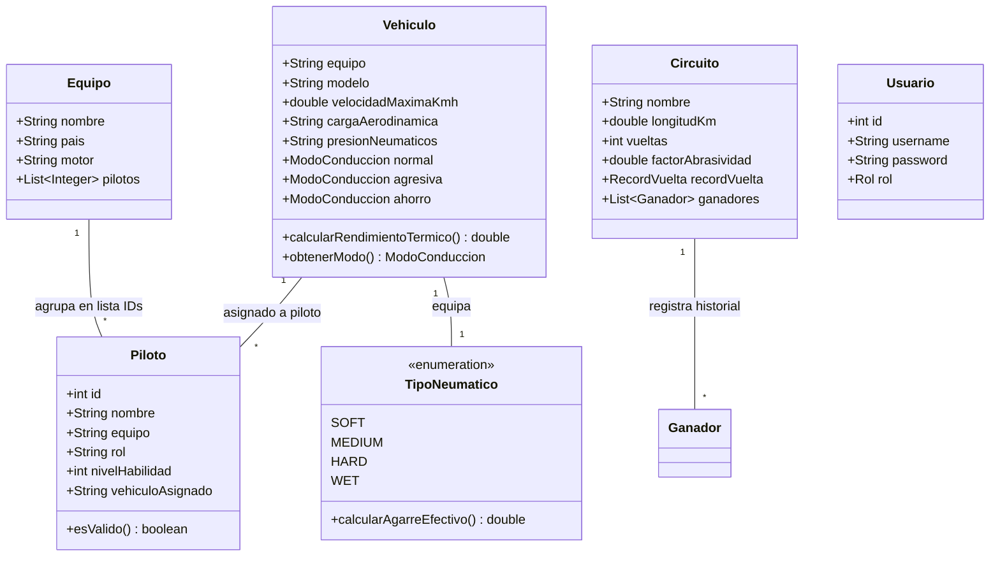
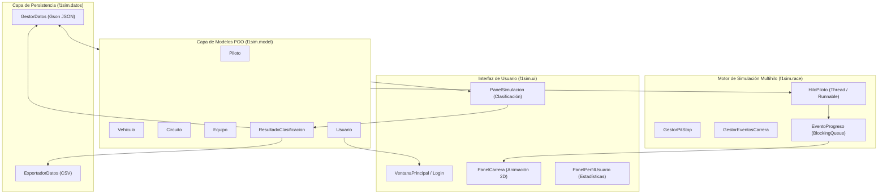

# Arquitectura y Relaciones de la Capa de Modelos (POJOs) en F1 Sim

## 1. Introducción y Filosofía POO de `f1sim.model`

La capa `f1sim.model` constituye el **Dominio del Sistema**. Está diseñada siguiendo estrictamente el estándar de **POJOs** (*Plain Old Java Objects*) y **DTOs** (*Data Transfer Objects*).

### ¿Por qué son POJOs Puros?
1. **Sin Dependencias de Frameworks**: No extienden de ninguna clase base externa ni requieren anotaciones complejas (como JPA, Spring o EJB).
2. **Encapsulamiento y Constructores Flexibles**: Ofrecen constructores por defecto (requeridos para la reflexión en JSON) y constructores parametrizados para la creación segura de instancias.
3. **Compatibilidad Nativa con Google Gson**: Todos los atributos de estas clases son mapeados de forma directa y transparente hacia y desde los archivos `.json` ubicados en la carpeta `data/`.

---

## 2. Análisis Exhaustivo de los Archivos del Modelo

### 2.1. `Piloto.java`
Representa a un corredor oficial dentro del campeonato.
- **Atributos Clave**: `id`, `nombre`, `equipo`, `rol` ("Lider" o "Escudero"), `experiencia`, `nivelHabilidad` (1 a 100), `victorias`, `podios`, `puntos`, `vehiculoAsignado`.
- **Relaciones**:
  - Pertenece a una escudería a través del campo `equipo` (nombre del equipo).
  - Está asociado a un auto específico mediante `vehiculoAsignado` (modelo del vehículo).
- **Uso en el Sistema**: Sus variables `experiencia` y `nivelHabilidad` alimentan directamente las fórmulas físicas en `HiloPiloto` y `PanelSimulacion` para determinar la velocidad promedio y el tiempo de vuelta.

### 2.2. `Equipo.java`
Representa una escudería de Fórmula 1.
- **Atributos Clave**: `nombre`, `pais`, `motor`, `pilotos` (Lista de IDs de pilotos), `imagen`.
- **Relaciones**:
  - Mantiene una relación 1 a N con `Piloto` almacenando la lista de sus identificadores numéricos.
  - Se vincula con `Vehiculo` a través de la pertenencia de marca (`equipo`).

### 2.3. `Vehiculo.java`
Representa el monoplaza de carreras y su configuración técnica.
- **Atributos Clave**: `equipo`, `modelo`, `motor`, `velocidadMaximaKmh`, `aceleracion`, `cargaAerodinamica` ("baja", "media", "alta"), `presionNeumaticos` ("baja", "estandar", "alta"), `porcentajeDesgasteNeumatico`, `temperaturaNeumaticosC`.
- **Reglajes de Conducción**: Contiene instancias de `ModoConduccion` para los tres perfiles: `normal`, `agresiva` y `ahorro`.
- **Métodos Físicos**:
  - `calcularRendimientoTermico(modo, clima)`: Modifica la temperatura dinámica de los neumáticos (óptima entre 90°C y 105°C) y aplica penalizaciones por sobrecalentamiento (>110°C) o falta de temperatura (<80°C).
  - `obtenerModo(nombreModo)`: Retorna el perfil de rendimiento correspondiente.

### 2.4. `Circuito.java`
Representa el trazado donde se disputan las clasificaciones y carreras en vivo.
- **Atributos Clave**: `nombre`, `pais`, `longitudKm`, `vueltas`, `descripcion`, `climaPromedio`, `recordVuelta` (`RecordVuelta`), `ganadores` (`List<Ganador>`), `factorAbrasividad`.
- **Importancia en la Simulación**:
  - `longitudKm` y `vueltas` determinan la duración base de la carrera en `HiloPiloto`.
  - `factorAbrasividad` (ej. 1.1 o 1.25) multiplica directamente la tasa de desgaste de neumáticos y el consumo de combustible en vivo.

### 2.5. `Usuario.java`
Modelo de seguridad y control de acceso (RBAC).
- **Atributos Clave**: `id`, `username`, `password`, `rol` (`ADMIN` o `USUARIO`), `nombreCompleto`.
- **Rol en la Aplicación**: Determina qué acciones están permitidas. Si el rol es `ADMIN`, los paneles de la UI habilitan los botones CRUD de creación/edición. Si es `USUARIO`, solo permite simular y guardar estadísticas en su perfil personal.

### 2.6. `TipoNeumatico.java` (Enum)
Enumeración con comportamiento físico para los compuestos Pirelli F1: `SOFT`, `MEDIUM`, `HARD` y `WET`.
- **Atributos Clave**: `nombre`, `factorAgarreBase`, `tasaDegradacion`, `condicionOptima` ("Seco" o "Lluvia").
- **Método Físico**:
  - `calcularAgarreEfectivo(porcentajeDesgaste, clima)`: Aplica penalizaciones drásticas (hasta -40% de agarre) si se usan neumáticos secos sobre pista lluviosa o viceversa.

### 2.7. `ModoConduccion.java` y `DatosCondicion.java`
Modelan la respuesta del monoplaza según el modo seleccionado (Normal, Agresivo, Ahorro) en las tres condiciones climáticas (Seco, Lluvioso, Extremo).
- `DatosCondicion` almacena tres valores decimales: `seco`, `lluvioso` y `extremo`.

### 2.8. `ResultadoClasificacion.java`
Objeto de transferencia de datos (DTO) que registra cada sesión completada por un usuario.
- Guarda la fecha, nombre del piloto, modelo de auto, circuito, clima, modo, tiempos de vuelta y reglajes técnicos elegidos.

### 2.9. `Ganador.java` y `RecordVuelta.java`
Clases auxiliares de valor para almacenar récords históricos e historiales de ganadores por año.

---

## 3. Diagrama de Relaciones y Flujo de Datos

---

## 4. Relación Módulo por Módulo en la Arquitectura

### 4.1. Con `f1sim.datos` (Persistencia JSON)
- `GestorDatos` lee los archivos `pilotos.json`, `equipos.json`, `vehiculos.json`, `circuitos.json`, `usuarios.json` y `resultados.json` y los transforma directamente en colecciones de POJOs (`List<Piloto>`, `Map<String, Vehiculo>`, etc.).

### 4.2. Con `f1sim.race` (Simulación Multihilo)
- `HiloPiloto` recibe las instancias de `Piloto`, `Vehiculo` y `Circuito`.
- Durante la carrera, el hilo consulta continuamente `vehiculo.obtenerModo(...)` y `tipoNeumatico.calcularAgarreEfectivo(...)` para simular la velocidad por tick y emitir instancias de `EventoProgreso` a la `BlockingQueue`.

### 4.3. Con `f1sim.ui` (Interfaz Gráfica Swing)
- **`PanelPilotos`**, **`PanelEquipos`**, **`PanelVehiculos`**, **`PanelCircuitos`**: Muestran los POJOs en tablas `JTable` y permiten al `ADMIN` crear o modificar sus propiedades.
- **`PanelSimulacion`**: Toma los POJOs de vehículo y circuito seleccionados para ejecutar la simulación de tiempos de clasificación.
- **`PanelPerfilUsuario`**: Filtra la lista de `ResultadoClasificacion` para mostrar los tiempos del usuario autenticado.

---

## 5. Preguntas Clave para la Sustentación Oral

**1. ¿Por qué se utilizó un modelo POO basado en POJOs en lugar de acceder directamente al JSON?**
> *"Porque separar los datos en clases POO permite aplicar los principios de la Programación Orientada a Objetos (encapsulamiento, métodos de dominio y modularidad). El JSON es solo el medio de almacenamiento; en memoria trabajamos con objetos Java puros."*

**2. ¿Cómo se relacionan un Piloto y un Vehículo en el código?**
> *"Existe una doble vinculación: la clase `Vehiculo` contiene una lista de IDs de los pilotos de su equipo (`public List<Integer> pilotos`), y la clase `Piloto` contiene el modelo del auto asignado (`public String vehiculoAsignado`)."*

**3. ¿Dónde se ejecutan los cálculos de la física de los monoplazas?**
> *"Los cálculos de degradación térmica y agarre de neumáticos están encapsulados dentro del enum `TipoNeumatico` y la clase `Vehiculo`, mientras que la aceleración y los tiempos por vuelta en tiempo real son procesados ciclo a ciclo en la clase multihilo `HiloPiloto`."*
